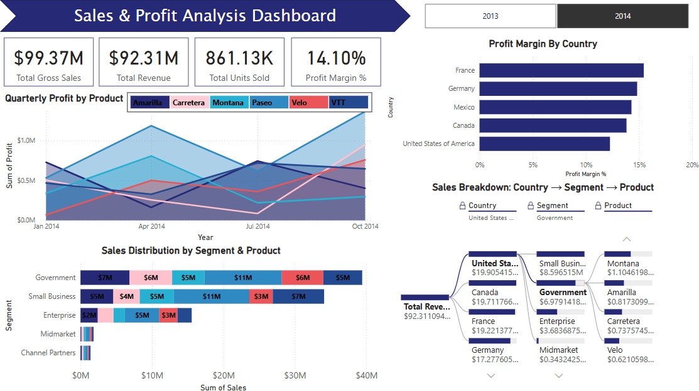

# Sales & Profit Analysis Dashboard - Power BI

This Power BI dashboard provides a comprehensive analysis of global sales performance and profitability across product categories, market segments, and countries.

## 📊 Key Insights:
- KPIs: Gross Sales, Revenue, Units Sold, and Profit Margin %
- Profit trends by product and quarter
- Sales distribution by customer segment and product
- Profit margin comparison across countries
- Interactive decomposition tree: Country → Segment → Product

## 🧠 Tools & Techniques:
- Power BI Desktop
- DAX measures
- Decomposition Tree visual
- Interactive slicers and filters

## 🏁 Outcome:
This dashboard enables stakeholders to quickly identify top-performing products, understand revenue contribution by market, and evaluate margin performance across geographies.

---

## 🖼️ Dashboard Preview:

---

## 🔗 Connect with Me
[LinkedIn Profile](https://www.linkedin.com/in/tgnandini/)
